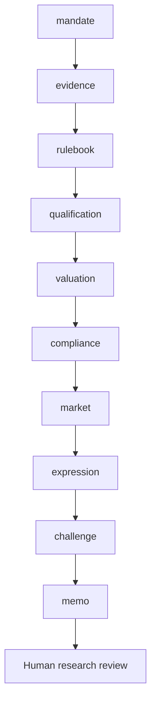

# Workflow

Does the evidence support the stated fund mandate under the versioned prospectus and applicable rulebook, and where is the result unknown?

Routes: `sfdr-mandate`, `uk-sdr-mandate`, `custom-mandate`. These named use cases share a sequential evidence/review core; they are not separately calibrated financial models.

| Step | Research task | Stage ID |
|---|---|---|
| 1 | Mandate and investable decision | `mandate` |
| 2 | Evidence intake and reconciliation | `evidence` |
| 3 | Mandate and applicability register | `rulebook` |
| 4 | Issuer sustainable-investment evidence | `qualification` |
| 5 | Portfolio thresholds and uncertainty | `valuation` |
| 6 | Independent interpretation and sign-off preparation | `compliance` |
| 7 | Market context and implementation evidence | `market` |
| 8 | Investment-decision handoff | `expression` |
| 9 | Independent challenge and exceptions | `challenge` |
| 10 | Investment committee and accountable review | `memo` |

A COMPLETE artifact is structurally complete, not certified correct. Material gaps stop dependencies. Open MATERIAL/CRITICAL issues block research approval. A source-study intentionally stops after the evidence stage.
